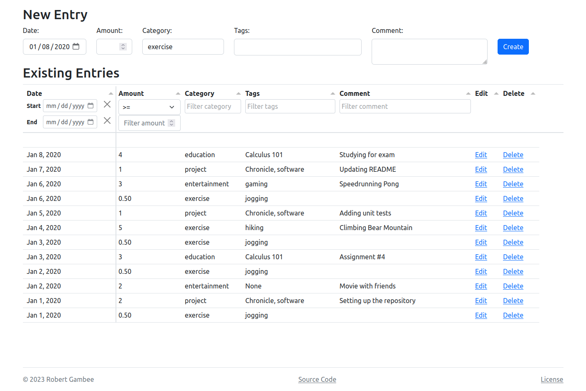
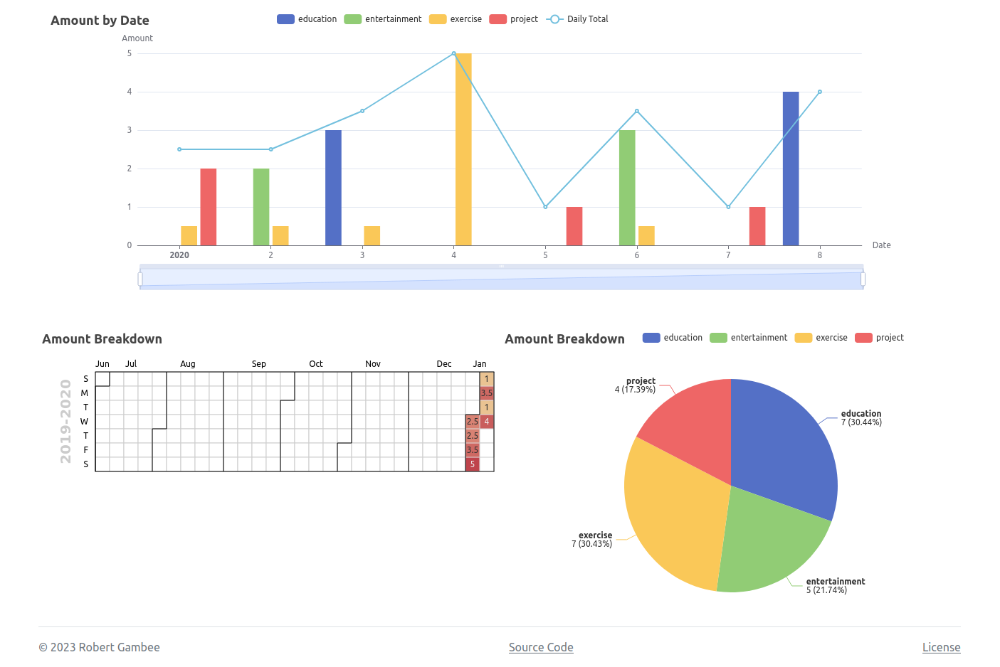

# Chronicle

[](https://github.com/PyCQA/pylint)
[](https://mypy-lang.org/)
[](https://github.com/psf/black)
[](https://pycqa.github.io/isort/)
[](https://github.com/rgambee/chronicle/actions/workflows/deploy.yml)

Chronicle is a web app that helps you track how you allocate resources. My
motivation for creating it was to track how I spend my time, hence the name,
but it works equally well for tracking money.

Even though Chronicle is a web app that's used via a browser, it's intended to
run locally and offline. There are no plans to host it publicly.

## Features

There are two main pages. The entry list lets you add new entries and see a
table of past ones. The table can be sorted or filtered however you like.



The second page lets you visualize the data. You can see how your spending has
changed over time, as both a bar chart and a heat map. The pie chart
illustrates how your spending is split among various categories.



## Instructions

First, clone this repository.

```bash
git clone https://github.com/rgambee/chronicle.git
cd chronicle
```

### Dependencies

#### Recommended: `Pipenv`

The recommended way to set up dependencies is using
[Pipenv](https://pipenv.pypa.io/), which will create a virtual
environment and install the required packages.

```bash
# Install pipenv
pip install pipenv
# Create a virtual environment and install the project dependencies
# Add --dev for development tools (not required for normal use)
pipenv install  # --dev
# Activate the virtual environment
pipenv shell
```

#### For those in a hurry

The only package that's strictly required is Django 4.1.x. If you don't want to
use Pipenv, you can just install Django by itself.

```bash
pip install django~=4.1
```

#### Optional: npm packages

No npm packages are required to run the app. They're only development tools. If
you want to install them, run

```bash
npm install
```

### Database

The repository contains a starter database with demo data if you just want to
poke around. Configure the app to use it by running

```bash
export CHRONICLE_DATABASE="demo.sqlite3"
```

Or to create a new blank database, run

```bash
./manage.py migrate
```

### Running

Start the app with

```bash
./manage.py runserver
```

In your browser, navigate to [http://127.0.0.1:8000](http://127.0.0.1:8000)
and enjoy!

## Organization

Chronicle follows the organization of a typical, single-app Django project.
Perhaps counter-intuitively, the `chronicle/chronicle/` directory contains very
little of interest. Most of the code is in `chronicle/tracker/`, which contains
both the backend and frontend code, along with tests.

## Copyright and License

Copyright &copy; 2023 Robert Gambee

This program is free software: you can redistribute it and/or modify
it under the terms of the GNU Affero General Public License as published by
the Free Software Foundation, either version 3 of the License, or
(at your option) any later version.

This program is distributed in the hope that it will be useful,
but WITHOUT ANY WARRANTY; without even the implied warranty of
MERCHANTABILITY or FITNESS FOR A PARTICULAR PURPOSE. See the
GNU Affero General Public License for more details.

You should have received a copy of the GNU Affero General Public License
along with this program. If not, see https://www.gnu.org/licenses/.
