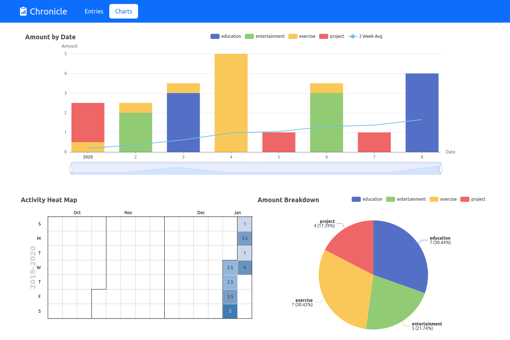

# Chronicle

[](https://github.com/PyCQA/pylint)
[](https://mypy-lang.org/)
[](https://github.com/psf/black)
[](https://pycqa.github.io/isort/)
[](https://github.com/rgambee/chronicle/actions/workflows/publish.yml)

Chronicle is a web app that helps you track how you allocate resources.
**[Click here](https://rgambee.github.io/chronicle/) to see a demo you can play
around with.**

The demo is a static, read-only version of the app. To actually use the app for
yourself, you must run it locally using the instructions in the section below.
There are no plans to host the dynamic version publicly.

My motivation for creating Chronicle was to track how I spend my time, hence
the name, but it works equally well for tracking money or other resources.

## Features

There are two main pages. The entry list lets you add new entries and see a
table of past ones. The table can be sorted or filtered however you like.


The second page lets you visualize the data. You can see how your spending has
changed over time, as both a bar chart and a heat map. The pie chart
illustrates how your spending is split among various categories.



## Instructions

First, clone this repository.

```bash
git clone https://github.com/rgambee/chronicle.git
cd chronicle
```

### Dependencies

Chronicle requires Python 3.9 or later.
An [automated workflow](https://github.com/rgambee/chronicle/actions) tests
compatibility with versions 3.9 through 3.11. Newer Python versions will likely
work too.

Assuming you have a suitable Python version installed, the next step is to
install the relevant Python packages. There are a couple of ways to do this.

#### Recommended: `Pipenv`

The recommended way to set up dependencies is using
[Pipenv](https://pipenv.pypa.io/), which will create a virtual
environment and install the required packages.

```bash
# Install pipenv
pip install pipenv

# Run `pipenv install`, which will automatically create a virtual environment
# and install the primary packages.
# Add --categories for development tools (not required for normal use).
pipenv install  # --categories="packages linters tests"

# Activate the virtual environment created by the previous command
pipenv shell
```

#### For those in a hurry

The only package that's strictly required is Django 4.1.x. If you don't want to
use Pipenv, you can just install Django by itself.

```bash
pip install django~=4.1
```

#### Optional: JavaScript packages

No JavaScript packages are required to run the app. They're only development
tools. If you want to install them, run

```bash
npm install
```

### Database

The repository contains a starter database with demo data if you just want to
poke around. Configure the app to use it by running

```bash
export CHRONICLE_DATABASE="demo.sqlite3"
```

Or to create a new blank database, run

```bash
./manage.py migrate
```

The new database will be named `db.sqlite3`.

### Running

Start the app with

```bash
./manage.py runserver
```

In your browser, navigate to [http://127.0.0.1:8000](http://127.0.0.1:8000)
and enjoy!

### Demo Mode

Chronicle can be started in a read-only, demo mode. In this mode, you can see
existing entries in the database but not make any changes. The purpose of demo
mode is for replicating a
[static version of the site](https://rgambee.github.io/chronicle/) that can be
hosted on GitHub Pages for anyone to view.

To enable demo mode, set the `CHRONICLE_DEMO_MODE` environment variable before
starting the app.

```bash
export CHRONICLE_DEMO_MODE=1
./manage.py runserver
```

To disable demo mode, unset the environment variable.

```bash
export CHRONICLE_DEMO_MODE=
./manage.py runserver
```

## Organization

Chronicle follows the organization of a typical, single-app Django project.
Perhaps counter-intuitively, the `chronicle/` directory contains very little of
interest.

Most of the code is in the `tracker/` directory:

*   Server-side Python code: `models.py`, `views.py`, `forms.py`, etc.
*   Client-side JavaScript code: primarily `static/tracker/charts.js`
    and `static/tracker/entry_table.js`
*   HTML templates: `templates/tracker/entry_list.html`, etc.
*   Python tests: `tests/`

## Contributing

First of all, thank you for considering contributing to this project! I wrote
it largely as a learning exercise for myself, so I'm not expecting it to be
worked on (or honestly even used) by others. There are many other similar apps
out there, many of which may be better suited to your needs.

That said, there are some recommended tools for helping with development. If
you didn't install the development dependencies originally, you'll need to do
that before proceeding.

```bash
pipenv install --categories="linters tests"

# Activate the virtual environment if it isn't already active
pipenv shell
```

There are a suite of linters for enforcing code style and catching issues. You
can run through all of them with the `lint.sh` Bash script.

Python tests can be run with

```bash
./manage.py test
```

You can also use [Coverage](https://coverage.readthedocs.io/) to generate a
report of which parts of the codebase are covered by tests.

```bash
# Run tests and gather data
coverage run
# View coverage report in text form
coverage report
# Generate HTML report you can explore in a browser
coverage html
# Open htmlcov/index.html in a browser
```

The above checks are run automatically by a GitHub Actions
[workflow](https://github.com/rgambee/chronicle/actions) every time
a branch is pushed.

## Copyright and License

Copyright &copy; 2023 Robert Gambee

This program is free software: you can redistribute it and/or modify
it under the terms of the GNU Affero General Public License as published by
the Free Software Foundation, either version 3 of the License, or
(at your option) any later version.

This program is distributed in the hope that it will be useful,
but WITHOUT ANY WARRANTY; without even the implied warranty of
MERCHANTABILITY or FITNESS FOR A PARTICULAR PURPOSE. See the
GNU Affero General Public License for more details.

You should have received a copy of the GNU Affero General Public License
along with this program. If not, see https://www.gnu.org/licenses/.
